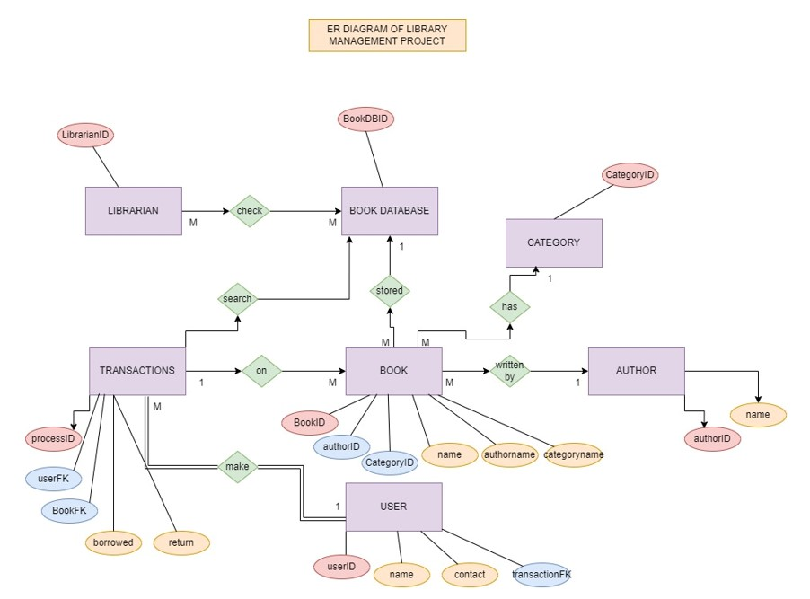
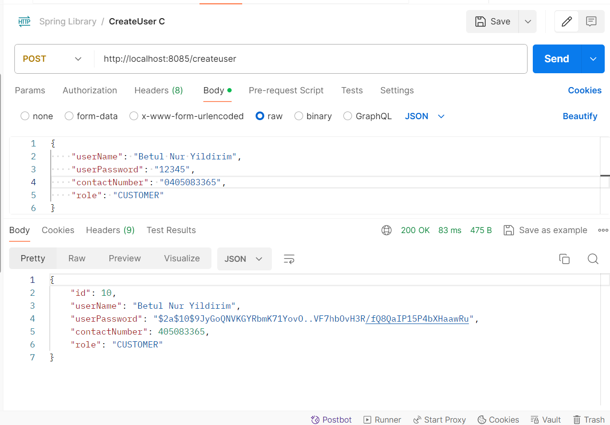
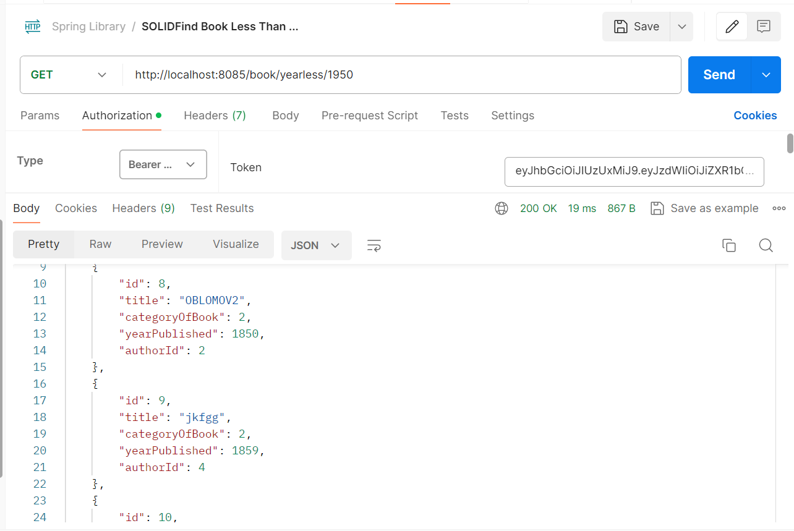
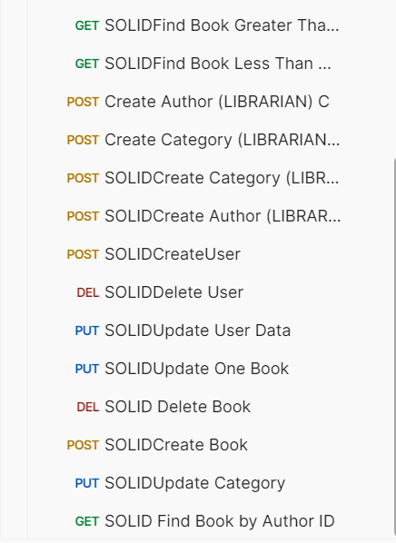

# 📚 Library Management System

A full-featured library management system designed to handle book inventories, user accounts, and borrowing processes efficiently. The system provides role-based authentication (admin and user) and allows admins to manage books, authors, and categories, while users can browse, borrow, and return books.

## 🚀 Tech Stack

- **Java 17**
- **Spring Boot** (REST API development)
- **Spring Data JPA** (database layer)
- **Spring Security + JWT** (authentication & authorization)
- **MySQL** (relational database)
- **Maven** (build tool)
- 
## 📂 Project Structure
src/main/java/com/javainuse
│
├── config/ # Security & JWT configurations
├── controller/ # REST API endpoints
├── dto/ # Data Transfer Objects
├── model/ # Entities (User, Book, Author, Category, etc.)
├── repository/ # JPA repositories
├── service/ # Business logic
└── LibraryApplication.java

## ✨ Features

✅ Role-based authentication (Admin & User)  
✅ Admins can manage **books, authors, and categories**  
✅ Users can **browse, borrow, and return books**  
✅ JWT-based login and secure API endpoints  
✅ Book search by title, author, or category  
✅ Track book availability and borrowing history  

## 📌 ER Diagram

## 📌 API Test Screenshots (Postman)
### Create User

### Sample

### Other Requests

